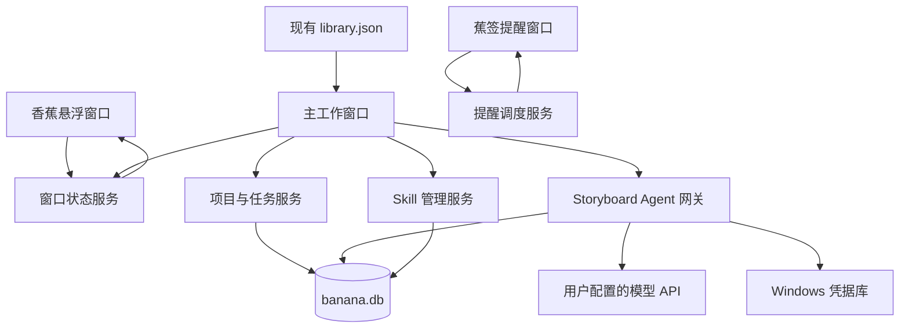

# Banana Box v1.0.0 大版本设计规格

- 日期：2026-07-11
- 基线版本：v0.2.2
- 目标版本：v1.0.0
- 状态：正式规格已确认（2026-07-11）
- 发布方式：五项功能在同一个版本统一上线，内部按里程碑开发

## 1. 背景与目标

Banana Box 当前是 Vue 3、Pinia 与 Tauri 2 构成的 Windows 桌面应用，已有主窗口、香蕉悬浮窗口、托盘、全局快捷键、开机启动、提示词库、图片反推和快速压缩功能。

本次大版本增加三个能力域：

1. 桌面交互：香蕉开合动画和贴近香蕉显示的通用提醒窗口。
2. 制作管理：项目看板、可重叠阶段时间线、当日任务、日报与工作日结算提醒。
3. 创作 Agent：可配置模型、可选 Skill、多轮文字对话、交互式设定收集和 Markdown 提示词输出。

目标是把 Banana Box 从提示词工具扩展为本地优先的创作与制作管理工作台，同时不破坏 v0.2.2 的已有数据和工作流。

## 2. 已确认的产品决定

### 2.1 发布与运行边界

- 五项功能统一发布为 v1.0.0，不拆成多个对外版本。
- 内部仍按依赖顺序开发和验收，最后统一打包。
- 每日提醒只保证应用正在运行、隐藏或驻留托盘时有效。
- 用户从托盘彻底退出应用后不提醒。
- “工作日”首版按本地时间周一至周五判断，不接入中国法定节假日调休表。
- Storyboard 首版只支持文字输入，不支持图片和文档附件。

### 2.2 香蕉状态

- 主窗口隐藏：未剥皮的闭合香蕉。
- 主窗口显示：剥开的香蕉。
- 点击、托盘、快捷键、文件拖入和失焦隐藏都必须同步香蕉状态。
- 开合共用同一组帧，关闭时反向播放。

### 2.3 提醒窗口

- 使用已确认的 B 方案“蕉签场记”。
- 提醒始终贴近香蕉图标，不固定在屏幕角落。
- 周一至周五 18:00，今天存在任务且尚未结算时提醒。
- 无操作 12 秒后自动收起，香蕉保留未读点。
- “稍后”延迟 30 分钟，每天最多使用一次。

### 2.4 项目阶段

固定八个阶段，顺序与颜色在所有项目中一致：

| 顺序 | 阶段 | 固定颜色 | 文字颜色 |
| --- | --- | --- | --- |
| 1 | 分镜 | `#F4C430` | `#17212B` |
| 2 | 初版 | `#1D4ED8` | `#FFFFFF` |
| 3 | 精修 | `#0F766E` | `#FFFFFF` |
| 4 | 中版 | `#15803D` | `#FFFFFF` |
| 5 | 特效 | `#C2410C` | `#FFFFFF` |
| 6 | 美术字 | `#BE123C` | `#FFFFFF` |
| 7 | 音乐 | `#6D28D9` | `#FFFFFF` |
| 8 | 合成终版 | `#334155` | `#FFFFFF` |

以上前景与背景组合的 WCAG 对比度均不低于 4.5:1，各页面不得自行更换文字色。

- 每阶段的开始日期、结束日期和 0–100% 进度均为必填；新建或编辑项目时一次提交完整八阶段，不保存缺日期的草稿项目。
- 阶段状态由进度派生：0% 为未开始，1–99% 为进行中，100% 为已完成，不单独保存可冲突的状态字段。
- 阶段日期允许相互重叠。
- 用户选择一个“主阶段”用于看板归类，项目卡只出现一次。
- 时间线上的“今天位置”和“实际进度”使用不同标记。
- v1.0.0 不计算一个合并的“项目总百分比”；看板卡显示主阶段进度，时间线显示八个阶段各自进度。

### 2.5 当日任务与日报

- 未完成任务在结算时由用户勾选是否转到明天。
- 任务同时保存自动更新时间和用户填写的投入时长。
- 支持复制整份日报和单个项目编号分组。
- 当天创建的所有任务都进入日报，包括 0–99% 的未完成任务。
- 日报使用结算时的真实百分比。
- 转到明天创建副本，不会删除或改变当天记录。

### 2.6 Storyboard、模型与 Skill

- Storyboard 使用独立的 API 地址、API Key 和模型设置，不复用图片反推设置。
- API 地址、API Key 和模型名均可配置。
- 默认优先匹配 `glm-5.2`；只有接口实际返回该模型时才自动选中。
- `glm-5.2` 不可用时明确提示并要求用户手动选择，不静默更换模型。
- 首个内置 Skill 为 `storyboard-prompt-optimizer`。
- Skill 作为应用资源打包，不在发布版中依赖 `C:\Users\Felix\.codex\skills\...`。
- Skill 更新由用户手动导入或确认，不自动更新。
- Skill 更新后，所有旧对话从下一条消息开始使用最新版本；历史消息保持不变。
- “其他”选项必须展开自由输入框，用户可以提交任意自定义答案。
- 最终提示词以 Markdown 渲染，复制到剪贴板时保留原始 Markdown 源文本。

## 3. 总体架构

采用“旧数据保留 + 新域使用 SQLite”的本地优先模块化方案。



### 3.1 三个窗口

1. `floatbtn`：香蕉动画、拖动、文件拖放和未读状态。
2. `main`：提示词库、故事板、项目管理、当日任务和设置。
3. `reminder`：透明、无边框、置顶、不进入任务栏、不抢键盘焦点的提醒窗口。

故事板、项目和任务不创建独立 Tauri 窗口，避免窗口管理复杂化。

### 3.2 主窗口尺寸

- 默认尺寸：约 `1080 × 720`。
- 最小尺寸：约 `760 × 560`。
- 窄窗口下看板允许横向滚动，故事板对话列表可折叠。
- 所有固定格式区域必须设置稳定尺寸，动态文字不能挤压按钮或改变布局。

### 3.3 前端模块边界

- `AnimatedBananaButton`：帧播放、反向播放、拖动与点击判定。
- `ReminderWindow`：统一提醒载荷、B 方案视觉、操作按钮与自动收起。
- `StoryboardPage`：会话导航、消息流和输入区。
- `ChoicePromptMessage`：Skill 的 2–3 项互斥选择与“其他”自由输入。
- `MarkdownPromptMessage`：Markdown 渲染、单段与整份复制。
- `ProjectBoardPage`：八阶段看板、筛选和归档。
- `ProjectTimeline`：重叠时间条、今天线和实际进度标记。
- `DailyTasksPage`：任务分组、排序、进度、备注、投入时长和日报。
- Pinia 按 `storyboard`、`projects`、`dailyTasks` 拆分，不继续堆入现有 `library` store。

### 3.4 Rust 模块边界

- `db`：SQLite 连接、事务和迁移。
- `window_state`：主窗口显隐状态和跨窗口事件。
- `reminder`：工作日调度、防重复、休眠补发和定位。
- `projects`：项目与阶段命令。
- `daily_tasks`：任务、结算、日报格式化和转到明天。
- `agent`：模型列表、流式聊天、取消、重试和错误映射。
- `skills`：内置资源、导入、版本和激活规则。
- `secrets`：Windows 凭据库读写。
- `backup`：版本化导入导出与路径安全检查。

新增功能不继续集中加入现有大型 `commands.rs`。

## 4. 香蕉开合动画

### 4.1 素材

- 以当前剥开香蕉为视觉基准，重新制作风格一致的闭合香蕉和中间帧。
- 共 12 帧，包含闭合与打开两个终态。
- 每帧使用透明背景、统一画布、统一视觉中心和统一阴影方向。
- 运行时建议使用 12 帧、单帧 `256 × 256` 的 WebP 精灵图并启动时预加载。
- 将当前固定 `48 × 48` 的透明 `floatbtn` 窗口扩大到 `64 × 64` 逻辑像素；香蕉可见图严格不超过 52px，并居中预留至少 6px 阴影安全区，避免动画和阴影被裁切。
- 适配 Windows 100%–200% 缩放，窗口定位使用逻辑像素，素材按实际 DPR 清晰渲染。

### 4.2 播放规则

- 总时长 360ms。
- 点击后 50ms 内开始视觉反馈。
- 第 6 帧显示主窗口，避免等待完整动画后才响应。
- 关闭主窗口时先隐藏窗口，再反向播放到闭合终帧。
- 快速反复点击时从当前帧直接反向，不重置到起点。
- 拖动阈值和文件拖放沿用现有行为，不触发点击动画。
- 动画只改变帧和轻微滤镜，不改变悬浮窗口尺寸。
- 开启系统“减少动态效果”时使用 150ms 终态淡入淡出。

### 4.3 状态同步

Rust 保存主窗口真实状态并广播 `panel-visibility-changed`。以下入口全部走同一状态服务：

- 点击香蕉。
- 托盘菜单。
- 全局快捷键。
- 文件拖入后自动显示。
- 主窗口失焦隐藏。
- 主窗口关闭或应用退出。

### 4.4 悬浮位置恢复

- 拖动结束后保存 64px 窗口的逻辑坐标、所在显示器标识和保存时缩放因子。
- 启动、显示器移除、分辨率变化或 DPI 变化时，把位置夹紧到当前可用显示器工作区，确保整个窗口可见。
- 历史显示器不存在时选择距离原坐标最近的显示器；没有有效历史位置时放在主显示器右侧中部，距工作区边缘 16px。
- 位置校正后立即保存新坐标，彻底移除 `x=1700, y=540` 这类硬编码初始位置。

## 5. 蕉签提醒窗口

### 5.1 视觉规格

- 标准尺寸约 `276 × 132px`，内容少时最低 112px，最多扩展到 148px。
- 主背景 `#101C24`。
- 次级背景 `#162730`。
- 边框 `#2D4650`。
- 主文字 `#F4FBF8`。
- 次要文字 `#9EB4B8`。
- 状态黄 `#FFD85A`。
- 主操作薄荷绿 `#66F7D3`。
- 错误珊瑚红 `#FF7C73`。
- 圆角 6px，仅使用一层中性阴影。
- 左侧 4px 黄色状态轨道，右侧短尾巴指向香蕉。

### 5.2 定位与动效

- 默认在香蕉左侧显示，视觉间距 14px。
- 香蕉位于屏幕左侧或空间不足时镜像到右侧。
- 靠近上下边缘时先夹紧提醒窗口，再移动尾巴对准香蕉中心。
- 动画原点是尾巴尖端。
- 香蕉先轻摆，提醒以 `translateX(16px) + scaleX(.82)` 展开。
- 进入约 235ms，收回约 160ms。
- 显示时不主动激活、不抢当前应用的键盘焦点；用户主动点击提醒后允许窗口获得焦点。
- 指针悬停、键盘焦点进入或按钮按下时暂停 12 秒自动收起计时，离开后继续。

### 5.3 当日任务提醒

触发条件必须全部满足：

1. 本地日期为周一至周五。
2. 本地时间到达或超过 18:00。
3. 当天至少存在一项任务。
4. 当天尚未结算。
5. 初次提醒尚未显示，或唯一一次稍后提醒已经到期且尚未显示。

行为：

- “去结算”打开主窗口并直达当日任务。
- “稍后 30 分钟”每天最多一次。
- 12 秒无操作后收起并在香蕉显示 6px 黄色未读点。
- 应用休眠错过 18:00 时，同一本地日期内唤醒后补发一次。
- “自动投递”同一天最多包含一次初次阶段和一次稍后阶段；用户主动点击未读香蕉重新查看不算新的自动投递，也不创建新 phase。
- `reminder_log` 每个 `(kind, local_date, phase)` 保存一行，`phase` 为 `initial` 或 `snooze`，并记录 `state`、`delivery_id`、`attempt_token`、`owner_id`、`lease_expires_at`、`attempt_count`、`claimed_at`、`shown_at`、`acknowledged_at`、`snoozed_until` 和 `unread`；当天是否结算以 `daily_task_days.settled_at` 为准。
- 调度器通过该唯一键和条件更新原子领取对应阶段，领取生成 30 秒 lease；避免重启、重复调度器或双进程产生两个独立投递。
- Reminder 使用唯一窗口并按 `delivery_id` 幂等渲染；重试同一 delivery 只更新这一个窗口，不叠加新窗口。
- 每次 claim 生成新的 `attempt_token` 与 `owner_id`；显示前再次验证 token，ACK 也必须条件更新当前 token。失去 lease 的旧 owner 必须关闭自己持有的提醒窗口，迟到 ACK 无效。
- 窗口完成渲染后在 5 秒内发送 ACK；lease 到期仍无 ACK 时，当前进程或下次启动可以重试同一 delivery，最多 3 次。ACK 成功后该 phase 永不再次自动投递。
- 应用同时启用 Tauri 单实例约束；第二个进程只唤醒现有实例，fencing token 作为崩溃和竞态的第二层保护。
- 稍后提醒到期前如果任务已删除或当天已结算，取消稍后提醒。
- 重新打开已结算日期不会再次生成初次提醒或额外稍后提醒。

未读点规则：

- 自动收起后保留未读点。
- 存在未读点时，单击香蕉优先重新打开最近一条未读提醒，不切换主窗口。
- 点击“去结算”、点击关闭按钮或完成“稍后”操作后清除当前未读点。
- “稍后”到期再次弹出后，如果又自动收起，则重新显示未读点。
- 当天完成结算时无条件清除该日提醒的未读点。

统一提醒载荷预留 `kind`、`title`、`body`、`timestamp`、`actions` 和 `severity`，以后计时器可复用同一窗口。

## 6. Storyboard Agent

### 6.1 会话界面

- 左侧为本地会话列表，支持新建、搜索、重命名和删除。
- 删除会话前必须确认；确认后级联删除该会话消息。v1.0.0 不提供回收站或误删恢复，避免承诺没有数据语义支持的功能。
- 顶部始终显示当前模型与 Skill。
- 中间为多轮消息流。
- 底部为文字输入区，支持发送和停止生成。
- 助手消息支持重试和复制。
- 会话、消息顺序、失败状态和原始 Markdown 都保存在本地。

### 6.2 API 配置

Storyboard 设置独立保存：

- `base_url`
- `models_url` 或明确的模型发现路径
- `chat_completions_url`
- 默认模型名
- API Key 的系统凭据引用

不能继续使用现有“自动追加 `/v1`”的 URL 猜测规则。用户输入的服务地址必须通过明确配置或经过验证的兼容模板生成。

- `models_url` 与 `chat_completions_url` 默认必须与 `base_url` 同源。
- 默认要求 HTTPS；只有 `localhost`、`127.0.0.1` 和 `::1` 允许 HTTP。
- 跨源端点必须再次显示目标主机并由用户明确确认。
- HTTP 客户端不把 `Authorization` 头跟随到不同主机的重定向；跨主机重定向直接拒绝。

API Key 只保存在 Windows 凭据库。界面显示掩码，日志、数据库、备份和错误报告均不包含密钥。

### 6.3 Skill 打包与更新

- 将 `storyboard-prompt-optimizer` 的 `SKILL.md`、必要 `references` 和应用自有 `banana-skill.json` 清单作为 Tauri 资源打包。
- 清单固定包含 `skill_id`、`display_name`、`display_version`、`protocol_version`、SHA-256、文件路径与逐文件哈希。
- 首个内置版本由应用清单标记为 `storyboard-prompt-optimizer@1.0.0`；原 Skill frontmatter 不需要承担版本字段。
- 首次启动时注册为内置 Skill；应用升级带来的新内置版本只注册，不自动激活，仍由用户确认更新。
- 用户可以切换“无 Skill”或“分镜提示词优化器”。
- 用户可以选择本地 Skill 目录进行导入或更新。
- 更新前显示名称与版本，用户确认后激活。
- 没有清单的本地 Skill 只允许根目录 `SKILL.md` 与 `references/**/*.md`：目录深度最多 3 层、文件最多 32 个、单文件最多 256KB、总计最多 2MB；应用按规范化相对路径排序并生成清单、`local-YYYYMMDD-HHmmss` 展示版本和逐文件哈希。
- 有清单的 Skill 也必须满足相同文件数、深度和大小上限，目录中的允许文件必须与清单完全一致；未知扩展名或额外文件使导入失败。
- 相同内容哈希不重复导入。
- 历史版本内容不可变并可手动回退，但新消息默认解析当前激活版本。
- 切换当前对话的 Skill 后，从下一条消息开始生效，历史消息不重写。
- Banana Box v1.0.0 只支持 `protocol_version=1`；不受支持的协议版本可以查看但不能激活。
- 同一 Skill 的兼容更新在所有旧对话的下一次请求立即生效，包括进行中的工作流；结构化答案同时保存稳定 option ID 与可读文字，避免只依赖旧版标签。
- 手动切换为另一个 Skill 时，如果会话不在 `awaiting_story` 或 `free_chat`，必须提示将工作流重置为 `analyzing_context`；用户确认后保留历史消息并用已有故事重新分析，取消则保持原 Skill 与状态。

### 6.4 交互式信息收集

应用需要实现 Skill 使用的结构化提问协议：

- 故事正文和复杂自定义要求使用自由输入。
- Agent 先提取已经提供的模式、风格、时长、画幅和输出类型。
- 只询问会影响结果的缺失信息，不重复询问已有信息。
- 每轮最多 3 题。
- 每题严格提供 2–3 个互斥选项，推荐项排第一。
- “其他”展开当前题目的自由输入框，确认后把用户文字保存为正式答案。
- 模式可以可靠推断时直接说明，不再提问。
- 基础设定完成后提供“确认设定”和“修改设定”。
- 分镜结构完成后提供“确认并生成提示词”和“调整分镜”。
- 选项与自定义答案作为结构化消息保存在会话中。

结构化控件不能依赖对普通 Markdown 的正则猜测。后端定义并验证以下响应联合类型：

```text
analysis_result:
  inferred_mode, provided_fields, missing_fields, next_state

choice_prompt:
  questions[1..3]
  question.id, header, prompt, allow_custom
  question.options[2..3]
  option.id, label, description, recommended

confirmation:
  summary_markdown
  actions[2]

final_output:
  blocks[]
  block.id, kind, title, markdown

assistant_markdown:
  markdown
```

应用维护明确工作流状态机，而不是等模型自由决定界面类型：

```text
awaiting_story -> analyzing_context -> collecting_settings
-> confirming_settings -> drafting_storyboard -> confirming_storyboard
-> generating_output -> free_chat
```

- `analyzing_context` 固定期待 `analysis_result`，由应用根据 `missing_fields` 决定进入选项收集或直接确认。
- `collecting_settings` 固定期待 `choice_prompt`；`confirming_settings` 与 `confirming_storyboard` 固定期待 `confirmation`。
- `drafting_storyboard` 和普通后续讨论期待可流式的 `assistant_markdown`。
- `generating_output` 固定期待完整缓冲的 `final_output`，界面显示生成进度，不逐字渲染半个 Markdown 区块。
- 打包 Skill 时追加 Banana 协议适配说明：原文中要求调用 `request_user_input` 的位置改为返回 `choice_prompt`，不把 Codex 工具名直接发给 Provider。
- Provider 连接测试包含一个最小 Schema 探测；支持 JSON Schema 时记录 `structured_mode=json_schema`，否则使用 `structured_mode=strict_json`。
- 如果严格 JSON 连续两次校验失败，该 Provider 仍可用于无 Skill 普通聊天，但禁用交互式 Storyboard 并明确提示不兼容。
- 所有结构化回合先完整缓冲再渲染，不逐字显示半个控件或半个 JSON。
- 首次校验失败时执行一次自动修复请求；再次失败时显示“选项生成失败”，保留上下文并提供重新生成，不把畸形文本伪装成按钮。
- `allow_custom=true` 时由应用固定追加“其他”入口，自定义答案不占用 2–3 个预设选项名额。

### 6.5 Markdown 输出与复制

- 助手最终提示词以安全清理后的 Markdown 渲染。
- `final_output.blocks` 为复制边界的唯一来源；`kind` 使用稳定枚举，如 `storyboard`、`video`、`scene_reference` 和 `shot`。
- 数据库保存每个 block 的稳定 ID、类型、标题、顺序和原始 Markdown，不按标题文字或正则切割一整段模型输出。
- 提供“复制单个镜头”“复制故事板提示词”“复制生视频提示词”和“复制全部 MD”。
- 每个可复制区块的标题栏显示复制按钮；成功后显示短暂“已复制”反馈。
- 单段复制使用该 block 的 `markdown` 字段；复制全部时由应用按 block 顺序用两个换行拼接。
- 剪贴板内容必须是原始 Markdown，不是渲染后的 HTML；仅统一换行为 `\n`，不改标题、列表和正文。
- Markdown 标题、列表、时间段和换行必须原样保留。

### 6.6 模型请求流程

1. 读取当前会话的模型、Skill 和激活版本。
2. 按 Skill 规则选取必要参考资料。
3. 创建请求快照，固化 `provider_id`、模型、`skill_version_id`、Skill 与逐文件哈希、协议版本、系统提示版本和输入消息范围。
4. 组合系统指令、必要历史消息和本次用户输入。
5. 根据当前工作流状态发送普通流式 Markdown 请求或完整缓冲的结构化请求，响应模式在请求前已经确定。
6. 普通流式请求通过事件按 `request_id` 和 `thread_id` 推送增量文本。
7. 用户可取消；完成、取消、解析失败和网络失败都保存明确状态。
8. “重试原请求”创建新记录并复用原请求快照，保证可复现；另提供“使用当前模型与 Skill 重试”。

首版 Agent 不提供 Shell、文件读取、网络搜索或任意工具执行能力。

## 7. 项目管理

### 7.1 项目字段

- 唯一项目编号，例如 `L36`。
- 项目版本。
- 项目名称。
- 本地文件或文件夹地址。
- 计划发布时间。
- 主阶段。
- 归档状态。
- 创建时间和更新时间。

项目编号重复时阻止保存。文件地址可通过原生选择器选择文件或文件夹；地址失效时保留项目并标记“需要重新关联”，允许重新选择且取消选择不覆盖原地址。

### 7.2 看板

- 固定八列并使用已确认的固定颜色。
- 项目卡只显示在主阶段列中。
- 项目卡至少显示编号、名称、版本、当前主阶段进度和发布日期。
- 支持按编号、名称、阶段、发布日期和归档状态筛选。
- 修改主阶段后，看板位置和详情同步。
- 删除前确认；优先提供归档，归档项目仍可搜索。

### 7.3 时间线

- 每阶段独立设置必填的开始日期和结束日期；八个阶段日期全部有效后项目才可保存。
- 日期区间可以重叠，不因并行制作报错。
- 开始日期晚于结束日期时阻止保存。
- 每阶段只保存 0–100% 进度；未开始、进行中、已完成状态分别由 0%、1–99%、100% 派生。
- 虚线显示“今天”的日历位置。
- 每条阶段彩色条上的白色标记显示该阶段的实际进度。
- 日期位置和完成度绝不能合并成同一个指标。
- 看板卡只显示主阶段名称及主阶段进度；v1.0.0 不展示容易误导的八阶段合并总百分比。

## 8. 当日任务与日报

### 8.1 任务字段

- 本地日期。
- 当日任务分组引用；分组保存项目编号、可选项目引用和稳定排序。
- 任务名称。
- 组内排序。
- 0–100 整数进度。
- 备注。
- 用户填写的投入时长，界面使用小时与分钟，数据库保存总分钟数。
- 自动更新时间。
- 创建时间。
- 从哪一条历史任务转入的可选引用。
- 转入时的来源快照哈希，用于判断明日副本是否已被用户编辑。

### 8.2 页面与排序

- 任务按项目编号分组。
- 分组顺序保存在 `daily_task_groups.position`，重启和恢复后日报顺序不依赖数据库默认查询顺序。
- 每组序号从 1 开始自动生成。
- 用户拖动调整顺序后，日报序号立即同步。
- 编号旁提供“复制该组”。
- 页面提供“复制整份日报”。
- 支持查看历史日期。

### 8.3 日报格式

日报严格按下列格式生成：

```text
@日报
#L36
1.【L36】【三丽鸥跟进】【100%】
2.【L36】【412漫画发型跟进】【100%】
#L50
1.【L50】【混厄录像带切片制作】【50%】
```

格式规则：

- 所有当天任务均进入日报，包括 0% 和未完成任务。
- 百分比使用结算时的真实整数进度。
- 备注、投入时长和更新时间不写入日报。
- 每个编号分组内部重新从 1 编号。
- 复制单组时只输出该 `#编号` 及其任务。
- 复制整份时按页面分组顺序输出。

日报格式化必须实现为纯函数并用精确字符串测试覆盖。

### 8.4 结算与转到明天

1. 用户点击提醒中的“去结算”进入当日任务。
2. 系统列出所有进度不足 100% 的任务。
3. 未完成项默认勾选“转到明天”，用户可取消。
4. 转到明天创建新日期下的副本，保留原项目编号、名称、备注和当前进度。
5. 今天的任务与百分比保持不变。
6. 完成结算时保存日报原始文本快照和结算时间。
7. 结算后当天锁定；用户需要先“重新打开结算”才能编辑并生成新快照。

重新结算必须幂等：

- `(source_task_id, target_date)` 唯一，重复结算不能创建第二条明日副本。
- 仍勾选转入且明日副本未被编辑时，用今天最新值更新该副本。
- 取消转入且明日副本未被编辑时，删除该副本。
- 明日副本已被编辑时绝不静默覆盖或删除；结算界面显示冲突，让用户选择“保留明日版本”或“用今日版本覆盖”。

## 9. 数据设计

### 9.1 存储策略

- `library.json`：继续保存现有提示词库和非敏感 legacy 界面设置；API Provider 设置迁入 `ai_providers`。
- `banana.db`：保存所有新增业务域。
- Windows 凭据库：保存 API Key。

### 9.2 SQLite 表

| 表 | 主要用途 |
| --- | --- |
| `schema_migrations` | 记录数据库版本和已执行迁移 |
| `projects` | 项目基础信息、主阶段和归档状态 |
| `project_stages` | 八阶段日期、进度和排序，状态由进度派生 |
| `daily_task_days` | 本地日期、结算状态、结算时间和日报快照 |
| `daily_task_groups` | 当日项目编号分组、项目引用和稳定组顺序 |
| `daily_tasks` | 分组引用、名称、进度、备注、时长、组内排序和转入来源 |
| `storyboard_threads` | 会话名称、模型、Skill、工作流状态、协议版本、结构化上下文和时间戳 |
| `storyboard_messages` | 消息角色、内容、原始 Markdown、请求和错误状态 |
| `storyboard_message_blocks` | 最终输出的稳定复制区块、类型、顺序和原始 Markdown |
| `agent_requests` | 请求级 Provider、模型、Skill 版本、哈希、输入范围和终态快照 |
| `skills` | Skill 身份、来源和当前激活版本 |
| `skill_versions` | 不可变的 Skill 清单、文件内容、哈希和导入时间 |
| `ai_providers` | 图片反推与 Storyboard 的 API 地址、模型、绑定主机、`needs_credentials` 和本机凭据引用，不保存 Key |
| `reminder_log` | 初次与稍后提醒的领取、ACK、未读和结算状态 |

SQLite 约束与运行规则：

- 使用 Rust `rusqlite` 和 bundled SQLite，由单一数据库服务串行管理写入；耗时操作放入阻塞线程，不阻塞 Tauri 事件循环。
- 启用 `foreign_keys=ON`、WAL 和 `busy_timeout=5000`。
- 主键使用 UUID 文本；本地业务日期使用 `YYYY-MM-DD`；时间戳使用 UTC RFC 3339，显示时转换为本地时区。
- `projects.code` 使用不区分大小写的唯一约束。
- `project_stages` 使用 `(project_id, stage_key)` 唯一约束，`stage_key` 限定八个固定值，`progress` 限定 0–100，开始日期不得晚于结束日期。
- `daily_task_days.local_date` 唯一；任务进度限定 0–100，投入分钟数不得小于 0，组内位置不得小于 0。
- `daily_task_groups` 使用 `(day_id, code)` 和 `(day_id, position)` 唯一约束；日报始终按该 position 排序。
- 转入副本使用 `(source_task_id, target_date)` 唯一约束，并保存来源快照哈希以识别用户后续编辑。
- `storyboard_messages` 使用 `(thread_id, position)` 唯一约束，角色与消息终态使用 CHECK 枚举。
- `storyboard_threads.workflow_state` 限定已定义的八个状态，`workflow_protocol_version` 与经过 Schema 校验的 `workflow_context_json` 每次状态转换时在同一事务中保存，应用重启后可从断点继续。
- `agent_requests` 固化请求快照，终态限定为 `streaming`、`completed`、`cancelled`、`failed`、`interrupted`。
- `agent_requests` 建立按 thread 的部分唯一索引，保证每个会话最多一条 `streaming` 或其他非终态请求；消息 position 与请求创建在同一事务中分配，后端拒绝双击发送或并发重试。
- `skills.current_version_id` 外键指向不可变版本；相同 Skill 内容哈希唯一去重。
- `ai_providers` 修改端点主机时必须在同一事务中清空 `credential_ref` 并设置 `needs_credentials=true`；凭据引用不进入备份。
- `reminder_log` 使用 `(kind, local_date, phase)` 唯一约束，其中 `phase` 仅为 `initial` 或 `snooze`，`state` 仅为 `pending`、`shown`、`hidden`、`actioned` 或 `cancelled`。
- 项目阶段随项目删除级联；历史任务保存项目编号文本，项目外键删除时设为空，不能删除历史日报。
- 会话删除前确认，删除后级联消息、区块和请求；v1.0.0 不提供回收站。

所有多表写入使用 SQLite 事务。前端不直接写文件或接触 API Key，只调用 Rust 服务。

### 9.3 启动初始化与升级迁移

Rust 必须在开放正常业务 IPC 和挂载 Vue store 前完成初始化、迁移或崩溃恢复。启动按以下矩阵选择唯一路径：

| 启动状态 | 行为 |
| --- | --- |
| 没有 `library.json`、`banana.db` 和迁移侧车 | 全新安装：通过临时文件创建默认脱敏 JSON 与数据库，同时预置 `reverse-image`、`storyboard` 两个无凭据 Provider，校验后原子切换 |
| 存在 v0.2.2 `library.json`，没有 v1 数据库 | 执行下面的两阶段升级迁移 |
| 存在完整 v1 JSON 与数据库，没有未完成侧车 | 校验 schema 和文件可读性后正常启动 |
| 存在 `migration-v1.json` 且状态未完成 | 先执行崩溃恢复，再决定继续提交或回到原数据 |
| 数据文件存在但无法解析或版本不受支持 | 只显示恢复页，不加载空库、不挂载正常 store |

v1 二进制的前置条件是图片反推和 Storyboard 前端均只传 `provider_id`，由 Rust 凭据服务读取 Key；这属于代码实现，不是在用户运行迁移时动态修改代码。

准备阶段：

1. 独占迁移锁并把同目录侧车文件 `migration-v1.json` 写为 `state=preparing`；原 `library.json` 保持不动。该日志不能只存在尚未提交的临时数据库中。
2. 解析并验证现有 `library.json`，解析失败立即进入恢复页，绝不加载空库。
3. 审计真实数据中是否存在 `favorite` 和 `order`：已有值原样保留；`order` 缺失时按当前数组顺序重建；`favorite` 缺失时默认为 `false`，并在迁移摘要中说明无法重建历史上已经丢失的收藏。
4. 先创建 `banana.db.tmp`、执行全部 schema 迁移，再写入 `reverse-image` 与空的 `storyboard` Provider 记录。
5. 把现有图片反推 Key 写入 `reverse-image` 凭据身份并本地回读校验；此步骤不访问网络。
6. 生成不含任何 Key 的 `library.json.tmp` 和带时间戳的脱敏升级备份。
7. 验证临时 JSON、SQLite 外键、Provider 到凭据的关联、表版本和备份清单。
8. 对临时数据库执行 WAL checkpoint，关闭全部连接和文件句柄，再把侧车状态更新为 `prepared`。

提交阶段：

1. 把侧车状态更新为 `committing`。
2. 在同一磁盘卷内分别用原子替换把脱敏 JSON 和已关闭的数据库切换为正式文件；侧车哈希用于判断每个文件是否已完成切换。
3. 重新打开正式数据库并完成纯本地校验：schema、外键、Provider 记录和凭据回读均正确。
4. 把 `migration-v1.json` 写为 `state=complete` 后才删除临时文件并开放正常业务 IPC。
5. 应用正常启动后可以异步执行图片反推连接健康检查；离线、接口停机或 Key 失效只显示非阻塞警告，绝不能让本地数据升级失败。

崩溃恢复：

- `preparing`：删除可验证为本次迁移创建的临时文件，保留原 JSON 并重新开始。
- `prepared` 或 `committing`：根据正式文件、临时文件、哈希和侧车逐项完成剩余切换；若校验失败则进入恢复页，不自动覆盖任何有效原文件。
- `complete`：重复启动不再执行迁移，只校验正式文件版本。
- 凭据写入设计为幂等；迁移失败时原 JSON 仍保留原 Key，成功提交后正式 JSON 和所有生成备份均不含 Key。

## 10. 备份、安全与隐私

### 10.1 备份范围

备份包含：

- 提示词库。
- 项目与阶段。
- 当日任务与日报快照。
- Storyboard 会话与消息。
- Skill 与版本。
- 非敏感设置。

备份排除：

- API Key。
- 凭据库内容。
- 临时流式响应缓存。
- 调试日志中的敏感正文。

备份实现规则：

- 运行中的 `banana.db` 使用 SQLite Online Backup API 或 `VACUUM INTO` 生成一致快照，不能直接复制 WAL 模式下的数据库文件。
- 从解析后的内存模型生成脱敏 `library.json`，绝不把旧明文文件原样塞进备份。
- 备份包含版本化清单、逐文件哈希和数据库 schema 版本。
- 导入先解压到受控暂存目录，验证哈希、schema、JSON 和全部相对路径后，再通过恢复日志切换正式数据。
- 拒绝 `..`、绝对路径、符号链接、重解析点和越界写入，修复现有 ZIP 导入路径风险。
- 边解压边计数：压缩包最大 2GB、文件最多 10,000 个、单文件最大 512MB、总解压大小最大 4GB、单文件压缩比最大 100:1；任一上限触发即中止并清理本次暂存目录。
- 对暂存数据库执行 `integrity_check` 和 `foreign_key_check`；高于当前应用支持版本的 schema 直接拒绝，较旧 schema 只在暂存区迁移并重新校验。
- 恢复失败时保留当前正式数据，不产生 JSON 已恢复但 SQLite 未恢复的半完成状态。

导入入口明确区分两种模式：

- “导入旧版提示词库”接受 v0.2.2 `library.json` 或旧 ZIP，只合并提示词和兼容设置，不覆盖 v1 项目、任务与会话。
- 旧包检测到 `apiKey` 时，在落盘前从 JSON 剥离；如果对应凭据不存在则请求用户确认后写入 `reverse-image` 凭据，已存在时询问是否覆盖。任何情况下都不把旧 Key 再写回 JSON。
- “恢复 v1 完整备份”只接受带 v1 manifest、哈希和 schema 版本的完整备份，并走暂存验证与恢复日志流程。
- 备份中的 Provider 配置不保存 `credential_ref`，只保存非敏感端点、模型和原主机指纹；恢复后统一标记 `needs_credentials=true`。
- 只有恢复主机与已有凭据的绑定主机一致且用户明确确认时，才允许重新关联本机已有凭据；端点主机变化时必须清空旧绑定，绝不能把现有 Key 自动发送到备份或 legacy 导入带来的新主机。

### 10.2 WebView 与内容安全

- 为 Tauri WebView 设置合理 CSP，不继续保持完全关闭。
- 按窗口拆分最小 capability，提醒窗口和悬浮窗口只获得需要的权限。
- 模型 Markdown 必须安全清理，禁止脚本、事件属性和危险链接协议。
- 不使用 `v-html` 直接渲染未经清理的模型输出。
- 日志不写 API Key、完整系统提示词或完整故事正文。
- Skill 导入拒绝符号链接、重解析点、隐藏文件、目录穿越、可执行文件和超出大小上限的目录；有清单时逐文件哈希与文件集合必须完全匹配，无清单时先按 §6.3 白名单生成清单再固化哈希。

### 10.3 用户知情

首次发送 Storyboard 消息前提示：当前文字会发送到用户配置的模型服务商。项目路径、任务、未发送草稿和本地数据库不会自动上传。

## 11. 错误处理

| 场景 | 用户可见行为 |
| --- | --- |
| API Key 缺失 | 指向对应的图片反推或 Storyboard Provider 设置并阻止请求 |
| 模型不存在 | 保留输入，显示接口返回的可用模型，要求手动选择 |
| 401/403 | 提示检查 API Key 或服务权限 |
| 429 | 显示限流，保留消息并提供稍后重试 |
| 超时或断网 | 标记本条失败，允许重试，不丢输入 |
| 用户停止生成 | 保存已接收内容并标记“已停止” |
| 结构化响应两次校验失败 | 不渲染错误控件，保留上下文并提供“重新生成选项/输出” |
| 数据库写入失败 | 保持界面脏状态并提示重试，不显示假成功 |
| 迁移或崩溃恢复失败 | 只显示恢复页，暂停正常业务 IPC，列出安全备份与重试操作 |
| 启动时残留流式请求 | 将其从 `streaming` 原子改为 `interrupted`，允许用户重试 |
| 项目路径失效 | 标记“需要重新关联”，不删除项目 |
| Skill 导入无效 | 不替换当前版本，显示缺失文件或格式问题 |
| 提醒窗口无法定位 | 夹紧到当前显示器工作区内，不超出屏幕 |

## 12. 测试与验收

### 12.1 单元测试

- 日报格式、换行、编号、括号和百分比精确匹配。
- 0–100% 任务全部进入日报。
- 转到明天不改变当天任务和日报快照。
- 阶段日期校验、重叠区间、状态派生和固定前景/背景颜色映射。
- 主阶段与独立阶段进度互不覆盖。
- 工作日、18:00、初次与稍后两个幂等阶段、未读重开、ACK、休眠补发和结算清除逻辑。
- 数据库两阶段迁移成功、每一步崩溃后重启恢复和幂等执行。
- 全新安装、legacy 升级、正常 v1 启动、未完成侧车恢复和损坏数据恢复页五条启动路径。
- 全新安装预置两个无凭据 Provider，设置页和图片反推始终拥有稳定 `provider_id`。
- 离线、接口停机或旧 Key 失效不会阻塞纯本地迁移提交。
- 备份清单不包含 API Key。
- ZIP 路径规范化拒绝目录穿越。
- ZIP 文件数、大小、压缩比、未来 schema、`integrity_check` 和 `foreign_key_check` 限制。
- legacy 导入包中的明文 Key 在落盘前剥离并按覆盖规则进入凭据库。
- SQLite WAL 在线备份和跨 JSON/SQLite 的暂存恢复。
- Skill 选项每轮不超过 3 题，每题 2–3 个预设选项。
- “其他”自定义答案正确保存并进入模型上下文。
- Storyboard 工作流状态机只接受当前状态允许的响应联合类型，并正确跳过已提供信息。
- 工作流状态、协议版本和结构化上下文在重启后恢复；Skill 兼容更新与手动切换重置规则正确。
- 数据库约束保证单个会话只有一个活动请求，双击发送和并发重试只有一个成功。
- 结构化响应 Schema 校验、一次修复和失败降级。
- Markdown block 边界、单段与整份复制保持原始文本。
- 请求快照固化 Skill 哈希；重试原请求与使用当前版本重试的行为不同且可复现。
- API 端点同源、HTTPS/loopback 规则和跨主机重定向不携带 Authorization。
- Provider 恢复后默认需要凭据；主机不一致时绝不自动复用本机已有 Key。
- 重新结算对明日副本幂等，覆盖、删除和用户编辑冲突分支均有测试。
- 日报分组顺序在重启、恢复和重新排序后保持稳定。

### 12.2 Agent 模拟测试

使用本地模拟服务覆盖：

- 正常流式输出。
- 用户取消。
- 超时与断网。
- 401、403、429 和 500。
- 模型列表没有 `glm-5.2`。
- 响应中含不安全 HTML。
- 结构化 JSON 首次和二次解析失败。
- Agent 取消与正常完成同时到达的竞态，最终只能落入一个终态。

自动测试不调用付费模型接口。

### 12.3 桌面集成测试

- 香蕉点击后 50ms 内开始反馈，360ms 动画无跳帧。
- 动画中快速反点可以从当前帧反向。
- `64 × 64` 悬浮窗口内的 52px 香蕉和阴影在所有帧均不裁切。
- 悬浮位置在启动、显示器拔除和 DPI 变化后仍被夹紧在工作区，无历史位置时使用主显示器安全默认位置。
- 点击、托盘、快捷键、文件拖入和失焦隐藏状态一致。
- 提醒不抢其他软件的输入焦点。
- 用户点击提醒后可获得焦点，悬停和键盘焦点会暂停自动收起计时。
- 多显示器和 Windows 100%–200% 缩放不越界。
- 休眠跨过 18:00 后同日补发一次。
- Reminder 初次/稍后领取、窗口 ACK、应用重启和重复调度器不会产生第三次提醒。
- Reminder lease 到期在当前进程重试同一 delivery，用户手动重开不增加自动投递次数。
- Reminder 旧 owner 的迟到渲染和 ACK 被 fencing token 拒绝，第二进程只唤醒单实例。
- 迁移后图片反推仍能通过 `reverse-image` 凭据完成连接测试，前端拿不到明文 Key。
- Skill 导入覆盖符号链接、目录穿越、超限目录、重复哈希和更新后旧请求重试。
- 主窗口默认、最小尺寸和长中文内容均不重叠。
- 键盘导航、焦点样式、颜色对比度和减少动态效果可用。

### 12.4 视觉与完整 QA

实现完成后使用 Gstack：

- `browse`：验证主要页面和交互状态。
- `qa`：执行跨模块工作流回归。
- `design-review`：检查排版、颜色、溢出、动效和响应式表现。

发布门槛：自动化测试全部通过，不存在阻断或高严重度问题，五条核心用户流程均完成手工验收。

## 13. 内部里程碑与统一发布

### 里程碑 0：正式仓库与安全基线

- 克隆真实 GitHub 仓库并创建 `codex/v1-major-update` 分支。
- 修复 Prompt 字段丢失、密钥导出和 ZIP 路径风险。
- 建立 SQLite、迁移器和凭据服务。

### 里程碑 1：桌面交互

- 制作香蕉 12 帧素材。
- 实现窗口状态服务与动画同步。
- 新增 reminder 窗口和 B 方案提醒。

### 里程碑 2：制作管理

- 项目看板、八阶段时间线和固定颜色。
- 当日任务、日报、结算、转到明天和 18:00 调度。

### 里程碑 3：Storyboard Agent

- 独立 API 设置、模型发现、流式聊天和取消。
- 内置 Skill、手动更新和交互式选项。
- Markdown 渲染与快捷复制。

### 里程碑 4：集成、升级与发布

- 从 v0.2.2 真实数据升级测试。
- Gstack QA 和设计审查。
- 生成 Windows Tauri 安装包、更新日志和升级说明。
- v1.0.0 首发优先保留发布后 canary 的紧急下架/撤回更新清单能力，因此发布时要求 GitHub immutable releases 关闭；发布标签由 tag ruleset 禁止更新/删除，资产在 Approval B、发布前后和 canary 期间逐次核对 ID、大小与 SHA-256，但不宣称发布后的资产永久不可变。若未来启用 immutable releases，必须先另行确认不可撤回的事故处理方案。
- 全部功能统一发布为 v1.0.0。

## 14. 首版明确不做

- 应用彻底退出后的 Windows 后台提醒或计划任务。
- 中国法定节假日和调休日历。
- Storyboard 图片、视频和文档附件。
- Agent 工具调用、Shell、任意文件读取或联网搜索。
- 自动下载或静默更新 Skill。
- 自定义项目阶段模板。
- 团队协作、云同步和多人权限。
- 把已有提示词库一次性迁入 SQLite。
- 多个对外发布批次。

## 15. 完成定义

当且仅当以下条件全部满足，v1.0.0 才视为完成：

1. 五项用户功能均按本规格工作。
2. v0.2.2 文件中实际存在的提示词、收藏、顺序和设置在升级后不丢失；缺失顺序按数组恢复，缺失收藏按 `false` 迁移并向用户说明。
3. API Key 不出现在数据库、备份或日志中。
4. 图片反推与 Storyboard 都通过 Rust 凭据服务工作，前端不读取或回传明文 Key。
5. 自动化测试、桌面集成测试和 Gstack QA 全部通过。
6. 香蕉素材、B 款提醒、项目时间线、日报格式和 Storyboard 交互均通过最终视觉验收。
7. Windows 安装包可从 v0.2.2 安全升级，并具备脱敏升级备份和崩溃恢复路径。
